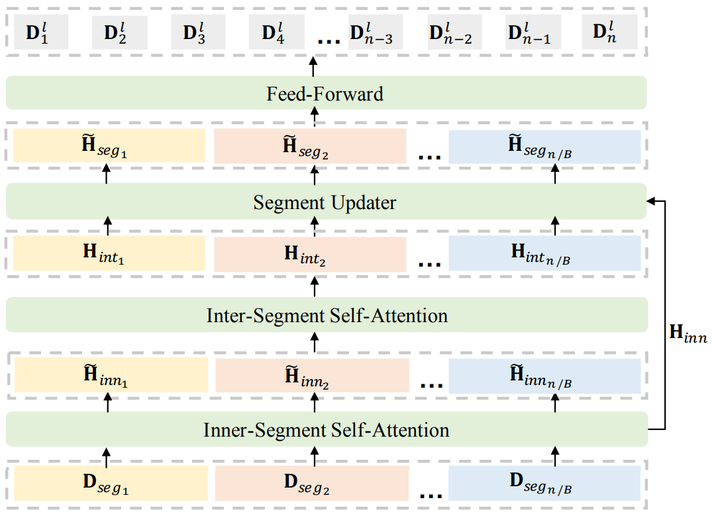

# hssa

Custom implementation of hierarchical segment-wise self-attention network (HHSA) from [Dialog-Post: Multi-Level Self-Supervised Objectives and Hierarchical Model for Dialogue Post-Training (Zhang et al., ACL 2023)](https://aclanthology.org/2023.acl-long.564/). Main difference is that each segment is separate utterance. Built upon [huffing face MPNet](https://github.com/huggingface/transformers/tree/31d452c68b34c2567b62924ee0df40a83cbc52d5/src/transformers/models/mpnet). You can load weights using `from_pretrained()` method. Example usage is provided [here](https://github.com/voorhs/hssa/blob/main/testbed.ipynb).

